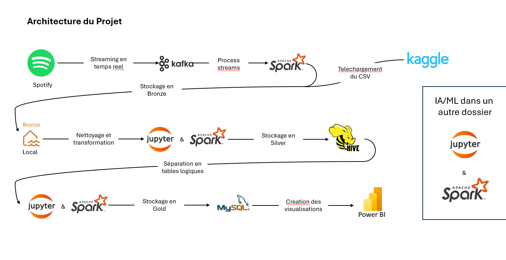

# 🎵 EFREI-M1-Big-Data-Programming-1-TP-Final

> **Projet Big Data Programming – EFREI M1**  
> **Participants** : Marius OZANNE, Chléo HINN, Bryan BONTRAIN

---


---

## 📋 Énoncé du projet

> Vous êtes dans la peau d'un architecte data. L'équipe métier vous soumet une problématique métier (celle que vous aurez trouvée).  
> Vous devez proposer une architecture permettant le traitement des données massives en vous appuyant sur une architecture en 3 couches : Datalake (bronze), Datawarehouse (silver), Datamart (gold).  
> L'équipe métier veut exploiter votre objet business final à travers une API, donc il faut une BDD en gold.  
> Cette base de données pourrait également être utilisée pour faire de la visualisation.  
> Pour des raisons de coûts et pour une solution tactique, vous avez décidé d'utiliser Hive comme datawarehouse.  
> En tant qu'architecte, vous tenez compte des problématiques de performance et de stockage et prenez les mesures nécessaires y afférentes.  
> Le métier se demande s'il est possible d'utiliser l'IA pour prédire des résultats ou faire des clusterings métiers. Il vous demande d'explorer cette piste.

**Problématique choisie** :  
> _Comment proposer des recommandations musicales personnalisées aux utilisateurs en temps réel, à partir de leurs historiques d’écoute et des caractéristiques des morceaux, en s’appuyant sur une architecture Big Data scalable ?_

---

## 🗂️ Sommaire

- [🎯 Contexte et Objectifs](#-contexte-et-objectifs)
- [🏗️ Architecture Globale](#-architecture-globale)
- [🎶 Sources de Données](#-sources-de-données)
- [⚙️ Pipeline de Traitement](#-pipeline-de-traitement)
- [🤖 Machine Learning](#-machine-learning)
- [🛠️ API et Datamart](#-api-et-datamart)
- [📊 Visualisation et Dashboards](#-visualisation-et-dashboards)
- [🚀 Prise en main](#-prise-en-main)
- [🗺️ Schéma d’architecture](#-schéma-darchitecture)
- [📎 Annexes](#-annexes)

---

## 🎯 Contexte et Objectifs

Ce projet vise à concevoir une architecture Big Data pour traiter et analyser des logs d’écoute musicale, afin de construire un système de recommandation musicale personnalisé.  
Le résultat est exposé via une API et peut être utilisé pour de la visualisation ou des analyses avancées (machine learning).

---

## 🏗️ Architecture Globale

L’architecture suit le modèle **3 couches** :

- 🥉 **Bronze (Datalake)** : stockage brut des logs d’écoute et des métadonnées des morceaux.
- 🥈 **Silver (Datawarehouse/Hive)** : nettoyage, enrichissement et structuration des données via Spark et Hive.
- 🥇 **Gold (Datamart)** : génération des recommandations personnalisées, exposition via une API, et préparation pour la visualisation ou l’analyse avancée.

---

## 🎶 Sources de Données

- **API Spotify** : récupération des historiques d’écoute et des caractéristiques audio des morceaux.
- **Dataset Spotify** : caractéristiques audio des morceaux ([Kaggle Spotify Dataset](https://www.kaggle.com/code/vatsalmavani/music-recommendation-system-using-spotify-dataset)).
- **(Optionnel)** : Simulateur de logs d’écoute (script Python) pour générer des données de test si besoin.

---

## ⚙️ Pipeline de Traitement

1. **Ingestion (Bronze)**  
   - Streaming des logs et stockage brut.
   - Ajout d’une seconde source (dataset Spotify venant de Kaggle).

2. **Transformation (Silver)**  
   - Nettoyage et enrichissement des données avec Spark.
   - Stockage structuré dans Hive.
   - Partitionnement des données par année (~ 30 ans) et répartition pour la parallélisation.

3. **Datamart (Gold)**  
   - Génération des recommandations personnalisées.
   - Stockage dans une base de données relationnelle.


---

## 🤖 Machine Learning

- Application d’un algorithme de machine learning (ex : clustering KMeans ou prédiction de préférences).
- Objectif : améliorer la pertinence des recommandations.

---

## 🛠️ API et Datamart

- API REST (FastAPI/Flask) permettant d’obtenir les recommandations pour un utilisateur.
- Base de données relationnelle pour stocker les recommandations finales.

---

## 📊 Visualisation et Dashboards

- Création de dashboards à partir des datamarts (ex : notebook Jupyter, outil BI).
- Visualisation des recommandations et analyses utilisateurs.

---

## 🚀 Prise en main

> **Prérequis**  
> - Python 3.8+  
> - Spark  
> - Hive  
> - (optionnel) Docker

### Installation

```bash
git clone https://github.com/MariusOzanne/EFREI-M1-Big-Data-Programming-1-TP-Final.git
cd EFREI-M1-Big-Data-Programming-1-TP-Final
pip install -r requirements.txt
```

### Récupération des données Spotify

Configurer les accès à l’API Spotify dans le fichier de configuration, puis lancer :

```bash
python api/get_saved_tracks.py
```

### (Optionnel) Lancer la simulation de données

```bash
python Source/simulation/spotify_api_simulation.py
```

### Lancer les traitements Spark/Hive pour chaque couche

```bash
python main.py
```

---

## 🗺️ Schéma d’architecture

<p align="center">
  
</p>

---

## 📎 Annexes

- **Captures Spark UI et base de données** : voir `docs/screenshots/`
- **Vidéo de démonstration** : voir `docs/demo_video.mp4`

---

<p align="center">
  <b>EFREI M1 – Big Data Frameworks 1</b><br>
  <i>Projet réalisé par Marius OZANNE, Chléo HINN, Bryan BONTRAIN</i>
</p>
